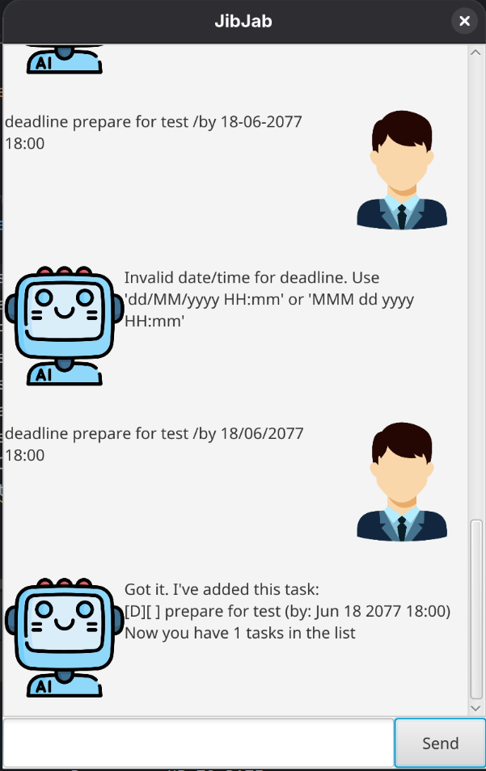

# JibJab User Guide

JibJab is a simple task‑tracking chatbot that lets you manage ToDos, Deadlines and Events via chat‑style commands. This guide explains how to set it up and use all important features.

---

## Using JibJab

- All commands are case‑sensitive and should be entered one per line.
- Dates/times are stored as plain text.
- Your tasks are saved automatically to `data/jibjab.txt` when you exit.

### Core commands

1) Add a ToDo
- Syntax: `todo DESCRIPTION`
- Example: `todo buy milk`

2) Add a Deadline
- Syntax: `deadline DESCRIPTION /by DATE_TIME`
- Example: `deadline CS2103T iP /by 2025-09-30 23:59`

3) Add an Event
- Syntax: `event DESCRIPTION /from START /to END`
- Example: `event team meeting /from 2025-09-20 14:00 /to 2025-09-20 15:30`

4) List tasks
- Syntax: `list`
- Shows all tasks with their index numbers and done status.

5) Find tasks
- Syntax: `find KEYWORD`
- Example: `find meeting`
- Shows tasks whose descriptions contain the keyword.

6) Mark a task as done
- Syntax: `mark INDEX`
- Example: `mark 2`

7) Unmark a task
- Syntax: `unmark INDEX`
- Example: `unmark 2`

8) Delete a task
- Syntax: `delete INDEX`
- Example: `delete 3`

9) Exit and save
- Syntax: `bye`
- Saves your tasks to disk and exits the app.

### Notes and tips
- Duplicate tasks cannot be added: JibJab will warn you if you try to add an identical task.
- If a command is incomplete or malformed (e.g., missing `/by` or `/from`/`/to`), JibJab will explain what’s missing.
- Indices in `mark`, `unmark`, and `delete` refer to the numbers shown by `list`.

## Graphical User Interface (GUI)
- Type commands into the input box at the bottom; press Enter to submit.
- Responses appear in the chat pane. The `bye` command will close the window.

## Storage
- File location: `data/jibjab.txt` (created automatically on first run).
- You can back up or edit this text file manually if needed.

## Troubleshooting
- If you see "I don't understand this command", check the command spelling and required parts like `/by`, `/from`, `/to`.
